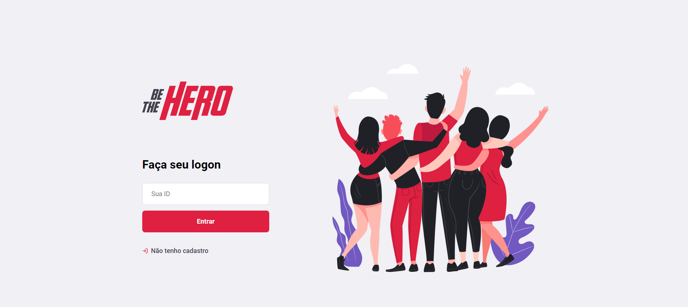

<h1 align="center">
    
</h1>

  

  

  

  

  

  <a href="#-tecnologias">Tecnologias</a>&nbsp;&nbsp;&nbsp;|&nbsp;&nbsp;&nbsp;
  <a href="#-projeto">Projeto</a>&nbsp;&nbsp;&nbsp;|&nbsp;&nbsp;&nbsp;
  <a href="#-backend">Backend</a>&nbsp;&nbsp;&nbsp;|&nbsp;&nbsp;&nbsp;
  <a href="#-frontend">Frontend</a>&nbsp;&nbsp;&nbsp;|&nbsp;&nbsp;&nbsp;
  <a href="#-mobile">Mobile</a>&nbsp;&nbsp;&nbsp;|&nbsp;&nbsp;&nbsp;
  <a href="#-como-executar">Como executar</a>&nbsp;&nbsp;&nbsp;|&nbsp;&nbsp;&nbsp;
  <a href="#memo-licença">Licença</a>

 

---

## 🚀 Tecnologias

Esse projeto foi desenvolvido com as seguintes tecnologias:

- [Node.js](https://nodejs.org/en/)
- [React](https://reactjs.org)
- [React Native](https://facebook.github.io/react-native/)
- [Expo](https://expo.io/)
- [Jest](https://jestjs.io/)
- [Celebrate](https://github.com/arb/celebrate)

## 💻 Projeto
Projeto desenvolvido durante a <strong>Semana OmniStack 11</strong> que tem como objetivo conectar pessoas que muitas vezes não tem tempo, mas podem ajudar ONGs de forma monetária.

## 🔨 Backend
<h1 align="center">

</h1>

## 🌐 Frontend
<h1 align="center">
    
</h1>

## 📱 Mobile
<h1 align="center">
    
</h1>

## 🤔 Como executar

- `git clone https://github.com/salvimateus/curso-oministack11.git`
- execute `npm install` nas 3 pastas
- `npm start` na pasta backend
- `npm start` na pasta frontend ou mobile

## 🧾 Licença

Esse projeto está sob a [licença MIT](LICENSE.md).

---

With 💙 by Mateus Salvi